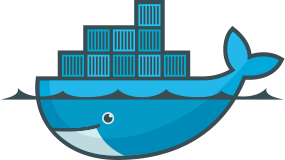

# Docker Workstation 

Docker Workstation is a ready to use workstation with nodejs, mongoldb, apache and more..

## Features

* None

## Requirements
* Docker and Docker Compose

## Installation

On project root folder use:

`$ docker-compose up -d --build`

## To-do

- install nodejs
- install mongodb
- install apache

## Contributing
Pull requests are welcome. For major changes, please open an issue first to discuss what you would like to change.

## License
[MIT](https://choosealicense.com/licenses/mit/)